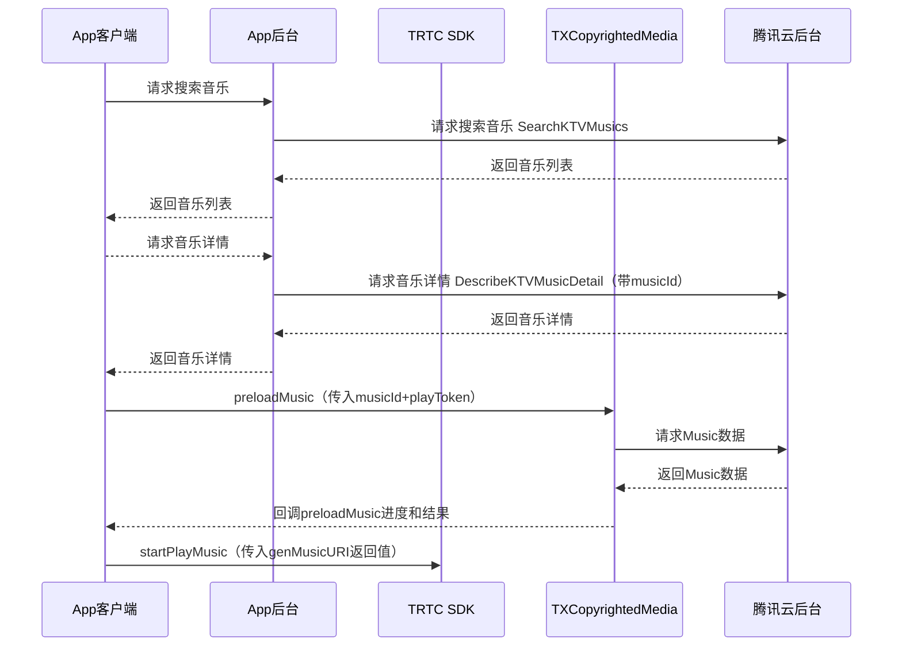

## E实时音视频TRTC & 正版版权曲库直通车AME在线KTV解决方案
## 一、产品概述
实时音视频TRTC & 版权曲库AME在线KTV联合解决方案深度整合腾讯在音视频深度积累的技术能力以及音乐内容版权上的核心优势产生1+1大于2的化学反应，帮助开发者极速搭建在线KTV业务。

实时音视频TRTC提供全球端到端平均延时<300 ms实时连麦以及10万人< 1s的超低延时观看的技术方案。
同时面向在线KTV场景提供48kHz采样率，128kbps立体声音频、低延时耳返让线上拥有媲美线下的KTV体验；更有变声、气氛音效、混响等多种趣味玩法。

正版曲库直通车(Authorized Music Express，AME)聚合TME等多家版权方优质曲目资源，结合腾讯云存储、编解码、内容分发、边缘计算等能力，有效解决多场景音乐素材应用版权问题。您可在控制台选购单曲/曲库包，提供下载/API/SDK多种接入方式，灵活高效实现正版音乐素材在多端的顺畅播放与应用。

## 二、产品原理

流程图：


## 三、接入前准备工作

## 3.1 账号注册及认证
• 注册[腾讯云账号](https://cloud.tencent.com/register?s_url=https%3A%2F%2Fcloud.tencent.com%2F)。<br>
• 完成[实名认证](https://cloud.tencent.com/document/product/378/3629)。<br>

## 3.2 服务开通
• 正版曲库直通车AME 服务开通：登录[正版曲库直通车AME控制台](https://console.cloud.tencent.com/ame)后，您可在勾选同意[腾讯云服务协议](https://cloud.tencent.com/document/product/301/1967)以及[正版曲库直通车服务协议](https://cloud.tencent.com/document/product/1155/40757)后单击【立即开通】，即可开通服务。<br>
• 实时音视频TRTC 服务开通：登录[实时音视频TRTC控制台](https://console.cloud.tencent.com/trtc)开通并使用产品。<br>


## 3.3 应用创建
您可在左导航栏进入【应用管理】页面，单击“创建应用”按钮，根据弹窗填空提示，填写相应的信息。
1. 应用名称：指接入APP应用名称。应用名称涉及版权授权，请准确填写，创建后无法再次修改。
2. Android PackageName：指接入应用在安卓应用市场的PackageName。请准确填写，创建后无法再次修改。
3. IOS BundleID：指接入应用在IOS应用市场的BundleID，请准确填写，创建后无法再次修改。
4. 应用场景：请根据接入应用的具体使用场景如实选择(语聊房/直播/FM)。
5. DAU：请基于接入应用实际情况准确填写。


## 3.4 白名单添加
因产品尚在内测，在正式接入之前，请联系对应商务经理为您添加白名单。

## 3.5 API联调

| API名称     | 描述   | 使用说明                   |
| ---------- | ------ | ---------------------- |
| SearchKTVMusics | 搜索KTV曲库 |  [文档地址](https://cloud.tencent.com/document/product/1155/56401) |
| DescribeKTVMusicDetail | 查询曲库歌曲详情 | [文档地址](https://cloud.tencent.com/document/product/1155/56402) |

a、首先调用 SearchKTVMusics 搜索目标歌曲，返回的列表包含歌曲的信息及Id

```java
// 请求
POST / HTTP/1.1
Host: ame.tencentcloudapi.com
Content-Type: application/json
X-TC-Action: SearchKTVMusics
<公共请求参数>

{
    "Limit": 10,
    "KeyWord": "周杰伦",
    "Offset": 0
}

// 响应
{
  "Response": {
    "TotalCount": 1,
    "KTVMusicInfoSet": [
      {
        "ComposerSet": [
          "方文山"
        ],
        "MusicId": "ame-78dxxx",
        "SingerSet": [
          "周杰伦"
        ],
        "Name": "七里香",
        "LyricistSet": [
          "周杰伦"
        ],
        "TagSet": [
          "华语",
          "流行"
        ]
      }
    ],
    "RequestId": "xx"
  }
}
```

b、根据上面接口返回的 Id 查询歌曲详情，包含 SDK 中所需要的 PlayToken

```java
// 请求
POST / HTTP/1.1
Host: ame.tencentcloudapi.com
Content-Type: application/json
X-TC-Action: DescribeKTVMusicDetail
<公共请求参数>

{
    "MusicId": "ame-78d2xxx"
}

// 响应
{
  "Response": {
    "PlayToken": "DUE3344xxxxxx",
    "KTVMusicBaseInfo": {
      "ComposerSet": [
        "周杰伦"
      ],
      "MusicId": "ame-78d2xxx",
      "SingerSet": [
        "周杰伦"
      ],
      "Name": "七里香",
      "LyricistSet": [
        "方文山"
      ],
      "TagSet": [
        "华语",
        "流行"
      ]
    },
    "RequestId": "xx"
  }
}
```


## 3.6 SDK接入
## 3.6.1 集成SDK
a、集成版权曲库SDK(拷贝TXCopyrightedMedia.framework)到项目工程中并集成

b、如果使用pod导入，则在podfile里面添加:
```
pod 'TXCopyrightedMedia'
```
c、[参考此处集成TRTC SDK](https://cloud.tencent.com/document/product/647/32173)

## 3.6.2 使用SDK

#### 获取TXCopyrightedMedia单例

**说明**

获取TXCopyrightedMedia单例

**接口**

```java
TXCopyrightedMedia *copyrightedMedia = [TXCopyrightedMedia instance];
```


#### 设置License

**说明**

设置license

**接口**

```java
[copyrightedMedia setLicense:licenseUrl key:key];
```

**参数说明**

| 参数名     | 类型   | 描述                   |
| ---------- | ------ | ---------------------- |
| licenseUrl | NSString | 控制台生成的licenseUrl |
| key        | NSString | 控制台生成的key        |


#### 初始化TXCopyrightedMedia

**说明**

初始化TXCopyrightedMedia。

**接口**

```java
[copyrightedMedia initialization];
```


#### 销毁TXCopyrightedMedia

**说明**

当程序退出后调用销毁。

**接口**

```java
[TXCopyrightedMedia destroy];
```


#### 预加载Music数据

**说明**

预加载Music数据，每次播放/重播前都需要调用该接口。

**接口**

```java
[copyrightedMedia preloadMusic:musicId bitrateDefinition:bitrateDefinition playToken:playToken callback:self]
```

**参数说明**

| 参数名    | 类型                  | 描述      |
| --------- | --------------------- | --------- |
| musicId | NSString              | 歌曲Id |
| bitrateDefinition | NSString | 码率描述（ audio/mi: 64 audio/lo: 128 audio/hi: 320） |
| playToken | NSString              | 播放Token |
| callback  | ITXMusicPreloadCallback | 回调代理 |


```java
@protocol ITXMusicPreloadCallback <NSObject>

@optional

- (void)onPreloadStart:(NSString *)musicId bitrateDefinition:(NSString *)bitrateDefinition;

- (void)onPreloadProgress:(NSString *)musicId
  			bitrateDefinition:(NSString *)bitrateDefinition
                 progress:(float)progress;

- (void)onPreloadComplete:(NSString *)musicId
  			bitrateDefinition:(NSString *)bitrateDefinition
                errorCode:(int)errorCode
                      msg:(NSString *)msg;

@end
```


#### 错误码

errorCode返回码定义如下

| 定义                          | 数值 | 描述              |
| ----------------------------- | ---- | ----------------- |
| TXCopyrightedErrorNoError     | 0    | 无错误            |
| TXCopyrightedErrorInitFail    | -1   | 初始化失败        |
| TXCopyrightedErrorCancel      | -2   | 用户取消数据获取  |
| TXCopyrightedErrorTokenFail   | -3   | token过期         |
| TXCopyrightedErrorNetFail     | -4   | 网络错误          |
| TXCopyrightedErrorInner       | -5   | 内部错误          |
| TXCopyrightedErrorParseFail   | -6   | 解析错误          |
| TXCopyrightedErrorDecryptFail | -7   | 解密错误          |
| TXCopyrightedErrorLicenseFail | -8   | License校验不通过 |


#### 取消预加载Music数据

**说明**

取消预加载Music数据。

**接口**

```java
[copyrightedMedia cancelPreloadMusic:musicId bitrateDefinition:bitrateDefinition];
```

**参数说明**

| 参数名    | 类型   | 描述      |
| --------- | ------ | --------- |
| musicId | NSString | 歌曲Id |
| bitrateDefinition | NSString | 码率描述（ audio/mi: 64 audio/lo: 128 audio/hi: 320） |


#### 检测是否已预加载Music数据

**说明**

检测是否已预加载Music数据。

**接口**

```java
BOOL isPreloaded = [copyrightedMedia isMusicPreloaded:musicId bitrateDefinition:bitrateDefinition];
```

**参数说明**

| 参数名            | 类型     | 描述                                                  |
| ----------------- | -------- | ----------------------------------------------------- |
| musicId           | NSString | 音乐Id                                                |
| bitrateDefinition | NSString | 码率描述（ audio/mi: 64 audio/lo: 128 audio/hi: 320） |


#### 生成Music URI

**说明**

生成Music URI，App客户端在preloadMusic成功之后调用，原唱&amp;伴奏传给TRTC进行播放。

**接口**

```java
NSString *musicUri = [copyrightedMedia genMusicURI:musicId bgmType:musicType bitrateDefinition:bitrateDefinition];
```

**参数说明**

| 参数名    | 类型   | 描述                       |
| --------- | ------ | -------------------------- |
| musicId | NSString | 歌曲Id                  |
| musicType   | Int    | 0：原唱，1：伴奏,  2：歌词 |
| bitrateDefinition | NSString | 码率描述（ audio/mi: 64 audio/lo: 128 audio/hi: 320） |

**返回说明**

| 返回值 | 类型   | 描述                                                         |
| ------ | ------ | ------------------------------------------------------------ |
| musicUri | NSString | 原唱&amp;伴奏：传给TRTC 播放的uri，格式 CopyRightMusic://audiotype=xxxx&musicid=xxxx&bitrate=xxxx；歌词：返回歌词的本地路径 |


#### 清理歌曲缓存

**说明**

清理本地所有缓存歌曲数据

**接口**

```java
[copyrightedMedia clearMusicCache];
```


#### 设置缓存歌曲最大数量

**说明**

设置缓存歌曲最大数量

**接口**

```java
[copyrightedMedia setMusicCacheMaxCount:maxCount];
```

**参数说明**

| 参数名   | 类型 | 描述                     |
| -------- | ---- | ------------------------ |
| maxCount | Int  | 歌曲最大缓存数量，默认50 |

#### 创建音乐轨道类

**说明**

创建音乐轨道类，用于获取音乐的数据帧数据，App客户端在preloadMusic成功之后调用

**接口**

```java
id<ITXCMMusicTrack> musicTrack = [[TXCopyrightedMedia instance] createMusicTrack:(TXCMusicInfo *)info];
```

**参数说明**

| 参数名    | 类型         | 描述     |
| --------- | ------------ | -------- |
| musicInfo | TXCMusicInfo | 歌曲信息 |


```objective-c
@interface TXCMusicInfo : NSObject

@property (nonatomic, copy) NSString *musicId;
@property (nonatomic, assign) int musicType;
@property (nonatomic, copy) NSString *bitrateDefinition;

@end

@protocol TXCMMusicTrackDelegate <NSObject>

@optional

- (void)onPrepared:(id<ITXCMMusicTrack>)musicTrack;

- (void)onError:(id<ITXCMMusicTrack>)musicTrack errCode:(int)errCode msg:(NSString *)msg;

@end

@protocol ITXCMMusicTrack <NSObject>

/// onPrepared后调用，返回采样率，16000、24000、32000、44100、48000等
- (int)getSampleRate;

/// onPrepared后调用，返回声道数
- (int)getChannelCount;

/// onPrepared后调用，返回音轨时长。单位:millisecond
- (int)getDuration;

/// 设置代理回调
/// @param delegate 代理
- (void)setDelegate:(id<TXCMMusicTrackDelegate>)delegate;

/// 准备音频数据，对musicId进行解密&拼接成m4a，然后准备把音乐参数解出来，异步回调onPrepared
- (void)prepare;

/// onPrepared后调用，开始音频解码
- (void)start;

/// 跳转音乐的解码进度，注意：请尽量避免过度频繁地调用该接口，因为该接口可能会再次读写音乐文件，耗时稍高。
/// @param pts seek时间，单位：ms,  接口会修正传入的pts的值，得到附近精确的pts
- (void)seek:(int *)pts;

/// 读帧， 如果为nil，则为读到末尾
- (TXCMAudioFrameInfo *)readAudioFrame;

/// 返回最小buffer大小
- (int)getMinBufferSize;

/// 停止音频轨道
- (void)stop;

/// 释放资源
- (void)destory;

/// 获取代理
- (id)getProxy:(id)engine;


```


## 3.6.3 代码示例

application 创建时候调用:
```java
[[TXCopyrightedMedia instance] setLicense:licence key:key];
```

进入主界面时候调用：

```java
[[TXCopyrightedMedia instance] initialization];
```


退出主界面时候调用：

```java
[TXCopyrightedMedia destroy];
```


进入K歌房间，点击K歌，下载Music：以声网的APIExample为例

```java
    let sampleRate:UInt = 32000, channel:UInt = 2, bitPerSample = 16, samples = 320 * 10
    var musicTrack: ITXCMMusicTrack?
    var proxy: IAgoraRtcEngine?
    private lazy var timer: DispatchSourceTimer? = {
        let timer = DispatchSource.makeTimerSource()
          let interval = 1024.0/32000
          timer.schedule(deadline: .now(), repeating: interval)
          timer.setEventHandler {
          DispatchQueue.main.async {
            if let frame = self.musicTrack?.readAudioFrame() {
              if let ret = self.proxy?.pushExternalAudioFrameRawData(frame, sourcePos: 0, samplesPerChannel: 1024, bytesPerSample: 2, channels: Int(self.channel), samplesPerSec: Int(self.sampleRate), renderTimeMs: 0, avSyncType: 0) {//本地播放
                NSLog("\(ret)")
              }
              if let ret = self.proxy?.pushExternalAudioFrameRawData(frame, sourcePos: 1, samplesPerChannel: 1024, bytesPerSample: 2, channels: Int(self.channel), samplesPerSec: Int(self.sampleRate), renderTimeMs: 0, avSyncType: 0) {//推到远端
                NSLog("\(ret)")
              }
            }
          }
        }
        return timer
    }()

    override func viewDidLoad(){
      super.viewDidLoad()
      loadCopyright()
    }
}

extension CustomPcmAudioSourceMain {
    func loadCopyright() {
        let licence = "xxxxxxxx"
        let key = "xxxxxx"
        TXCopyrightedMedia.instance().setLicense(licence, key: key)
        TXCopyrightedMedia.instance().initialization()
        TXCopyrightedMedia.instance().preloadMusic(musicId, bitrateDefinition: "", playToken: token, callback: self)
    }
}

extension CustomPcmAudioSourceMain: ITXMusicPreloadCallback {
    func onPreloadStart(_ musicId: String!, bistrateDefinition: String!) {
        
    }
    
    func onPreloadProgress(_ musicId: String!, bitrateDefinition: String!, progress: Float) {
        
    }
    
    func onPreloadComplete(_ musicId: String!, bitrateDefinition: String!, errorCode: Int32, msg: String!) {
        if errorCode == 0 {
            if let obj = self.musicTrack?.getProxy(agoraKit!) as? IAgoraRtcEngine {
                self.proxy = obj;
            }
            let info = TXCMusicInfo()
            info.musicId = musicId
            info.musicType = 0//原唱
            info.bitrateDefinition = bitrateDefinition
            self.musicTrack = TXCopyrightedMedia.instance().createMusicTrack(info)
            self.musicTrack?.setDelegate(self)
            self.musicTrack?.prepare()
        }
    }
}

extension CustomPcmAudioSourceMain: TXCMMusicTrackDelegate {
    func onPrepared(_ audioTrack: ITXCMMusicTrack) {
      	self.musicTrack?.start()
        self.timer?.resume()
    }
    
    func onError(_ audioTrack: ITXCMMusicTrack, errCode: Int32, msg: String) {
        
    }
}


```