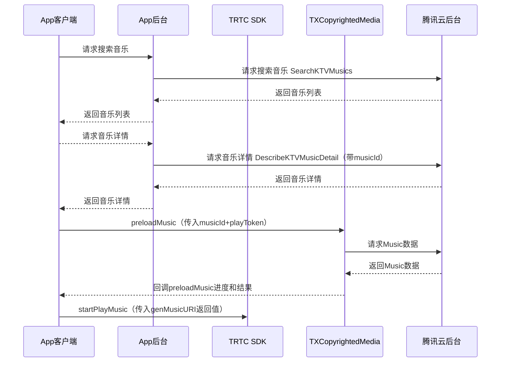

## 实时音视频TRTC & 正版版权曲库直通车AME在线KTV解决方案

## 一、产品概述

实时音视频TRTC & 版权曲库AME在线KTV联合解决方案深度整合腾讯在音视频深度积累的技术能力以及音乐内容版权上的核心优势产生1+1大于2的化学反应，帮助开发者极速搭建在线KTV业务。

实时音视频TRTC提供全球端到端平均延时<300 ms实时连麦以及10万人< 1s的超低延时观看的技术方案。
同时面向在线KTV场景提供48kHz采样率，128kbps立体声音频、低延时耳返让线上拥有媲美线下的KTV体验；更有变声、气氛音效、混响等多种趣味玩法。

正版曲库直通车(Authorized Music Express，AME)聚合TME等多家版权方优质曲目资源，结合腾讯云存储、编解码、内容分发、边缘计算等能力，有效解决多场景音乐素材应用版权问题。您可在控制台选购单曲/曲库包，提供下载/API/SDK多种接入方式，灵活高效实现正版音乐素材在多端的顺畅播放与应用。

## 二、产品原理

流程图：



## 三、接入前准备工作

## 3.1 账号注册及认证

• 注册[腾讯云账号](https://cloud.tencent.com/register?s_url=https%3A%2F%2Fcloud.tencent.com%2F)。<br>
• 完成[实名认证](https://cloud.tencent.com/document/product/378/3629)。<br>

## 3.2 服务开通

• 正版曲库直通车AME 服务开通：登录[正版曲库直通车AME控制台](https://console.cloud.tencent.com/ame)后，您可在勾选同意[腾讯云服务协议](https://cloud.tencent.com/document/product/301/1967)以及[正版曲库直通车服务协议](https://cloud.tencent.com/document/product/1155/40757)后单击【立即开通】，即可开通服务。<br>
• 实时音视频TRTC 服务开通：登录[实时音视频TRTC控制台](https://console.cloud.tencent.com/trtc)开通并使用产品。<br>


## 3.3 应用创建

您可在左导航栏进入【应用管理】页面，单击“创建应用”按钮，根据弹窗填空提示，填写相应的信息。

1. 应用名称：指接入APP应用名称。应用名称涉及版权授权，请准确填写，创建后无法再次修改。
2. Android PackageName：指接入应用在安卓应用市场的PackageName。请准确填写，创建后无法再次修改。
3. IOS BundleID：指接入应用在IOS应用市场的BundleID，请准确填写，创建后无法再次修改。
4. 应用场景：请根据接入应用的具体使用场景如实选择(语聊房/直播/FM)。
5. DAU：请基于接入应用实际情况准确填写。


## 3.4 白名单添加

因产品尚在内测，在正式接入之前，请联系对应商务经理为您添加白名单。

## 3.5 API联调

| API名称                | 描述             | 使用说明                                                     |
| ---------------------- | ---------------- | ------------------------------------------------------------ |
| SearchKTVMusics        | 搜索KTV曲库      | [文档地址](https://cloud.tencent.com/document/product/1155/56401) |
| DescribeKTVMusicDetail | 查询曲库歌曲详情 | [文档地址](https://cloud.tencent.com/document/product/1155/56402) |

a、首先调用 SearchKTVMusics 搜索目标歌曲，返回的列表包含歌曲的信息及Id

```java
// 请求
POST / HTTP/1.1
Host: ame.tencentcloudapi.com
Content-Type: application/json
X-TC-Action: SearchKTVMusics
<公共请求参数>

{
    "Limit": 10,
    "KeyWord": "周杰伦",
    "Offset": 0
}

// 响应
{
  "Response": {
    "TotalCount": 1,
    "KTVMusicInfoSet": [
      {
        "ComposerSet": [
          "方文山"
        ],
        "MusicId": "ame-78dxxx",
        "SingerSet": [
          "周杰伦"
        ],
        "Name": "七里香",
        "LyricistSet": [
          "周杰伦"
        ],
        "TagSet": [
          "华语",
          "流行"
        ]
      }
    ],
    "RequestId": "xx"
  }
}
```

b、根据上面接口返回的 Id 查询歌曲详情，包含 SDK 中所需要的 PlayToken

```java
// 请求
POST / HTTP/1.1
Host: ame.tencentcloudapi.com
Content-Type: application/json
X-TC-Action: DescribeKTVMusicDetail
<公共请求参数>

{
    "MusicId": "ame-78d2xxx"
}

// 响应
{
  "Response": {
    "PlayToken": "DUE3344xxxxxx",
    "KTVMusicBaseInfo": {
      "ComposerSet": [
        "周杰伦"
      ],
      "MusicId": "ame-78d2xxx",
      "SingerSet": [
        "周杰伦"
      ],
      "Name": "七里香",
      "LyricistSet": [
        "方文山"
      ],
      "TagSet": [
        "华语",
        "流行"
      ]
    },
    "RequestId": "xx"
  }
}
```


## 3.6 SDK接入

## 3.6.1 集成SDK

a、集成版权曲库SDK(拷贝TXCopyrightedMedia.framework)到项目工程中并集成

b、如果使用pod导入，则在podfile里面添加:

```
pod 'TXCopyrightedMedia'
```

如果搜索不到，原因是没有更新到源。建议使用 https://cdn.cocoapods.org/  做源。在`Podfile`最上面添加即可

```bash
source 'https://cdn.cocoapods.org/'
```

更新源

```
pod repo update trunk
```

清理Caches

```
rm -rf ~/Library/Caches/Cocoapods
```

c、[参考此处集成TRTC SDK](https://cloud.tencent.com/document/product/647/32173)

## 3.6.2 使用SDK

#### 获取TXCopyrightedMedia单例

**说明**

获取TXCopyrightedMedia单例

**接口**

```java
TXCopyrightedMedia *copyrightedMedia = [TXCopyrightedMedia instance];
```


#### 设置License

**说明**

设置license

**接口**

```java
[copyrightedMedia setLicense:licenseUrl key:key];
```

**参数说明**

| 参数名     | 类型     | 描述                   |
| ---------- | -------- | ---------------------- |
| licenseUrl | NSString | 控制台生成的licenseUrl |
| key        | NSString | 控制台生成的key        |


#### 初始化TXCopyrightedMedia

**说明**

初始化TXCopyrightedMedia。

**接口**

```java
[copyrightedMedia initialization];
```


#### 销毁TXCopyrightedMedia

**说明**

当程序退出后调用销毁。

**接口**

```java
[TXCopyrightedMedia destroy];
```


#### 预加载Music数据

**说明**

预加载Music数据，每次播放/重播前都需要调用该接口。

**接口**

```java
[copyrightedMedia preloadMusic:musicId extParams:extParams playToken:playToken callback:self]
```

**参数说明**

| 参数名    | 类型                    | 描述                                                         |
| --------- | ----------------------- | ------------------------------------------------------------ |
| musicId   | NSString                | 歌曲Id                                                       |
| extParams | NSString                | 码率描述，从服务器歌曲详情获取（ audio/mi: 代表64kbps码率 audio/lo:代表128kbps码率 audio/hi: 代码320kbps码率） |
| playToken | NSString                | 播放Token                                                    |
| callback  | ITXMusicPreloadCallback | 回调代理                                                     |


```java
@protocol ITXMusicPreloadCallback <NSObject>

@optional

- (void)onPreloadStart:(NSString *)musicId extParams:(NSString *)extParams;

- (void)onPreloadProgress:(NSString *)musicId
  			extParams:(NSString *)extParams
                 progress:(float)progress;

- (void)onPreloadComplete:(NSString *)musicId
  			extParams:(NSString *)extParams
                errorCode:(int)errorCode
                      msg:(NSString *)msg;

@end
```


#### 错误码

errorCode返回码定义如下

| 定义                          | 数值 | 描述              |
| ----------------------------- | ---- | ----------------- |
| TXCopyrightedErrorNoError     | 0    | 无错误            |
| TXCopyrightedErrorInitFail    | -1   | 初始化失败        |
| TXCopyrightedErrorCancel      | -2   | 用户取消数据获取  |
| TXCopyrightedErrorTokenFail   | -3   | token过期         |
| TXCopyrightedErrorNetFail     | -4   | 网络错误          |
| TXCopyrightedErrorInner       | -5   | 内部错误          |
| TXCopyrightedErrorParseFail   | -6   | 解析错误          |
| TXCopyrightedErrorDecryptFail | -7   | 解密错误          |
| TXCopyrightedErrorLicenseFail | -8   | License校验不通过 |


#### 取消预加载Music数据

**说明**

取消预加载Music数据。

**接口**

```java
[copyrightedMedia cancelPreloadMusic:musicId extParams:extParams];
```

**参数说明**

| 参数名    | 类型     | 描述                                                         |
| --------- | -------- | ------------------------------------------------------------ |
| musicId   | NSString | 歌曲Id                                                       |
| extParams | NSString | 码率描述，从服务器歌曲详情获取（ audio/mi: 代表64kbps码率 audio/lo:代表128kbps码率 audio/hi: 代码320kbps码率） |


#### 检测是否已预加载Music数据

**说明**

检测是否已预加载Music数据。

**接口**

```java
BOOL isPreloaded = [copyrightedMedia isMusicPreloaded:musicId extParams:extParams];
```

**参数说明**

| 参数名    | 类型     | 描述                                                         |
| --------- | -------- | ------------------------------------------------------------ |
| musicId   | NSString | 音乐Id                                                       |
| extParams | NSString | 码率描述，从服务器歌曲详情获取（ audio/mi: 代表64kbps码率 audio/lo:代表128kbps码率 audio/hi: 代码320kbps码率） |


#### 生成Music URI

**说明**

生成Music URI，App客户端在preloadMusic成功之后调用，原唱&amp;伴奏传给TRTC进行播放。

**接口**

```objective-c
NSString *musicUri = [copyrightedMedia genMusicURI:musicId bgmType:musicType extParams:extParams];
```

**参数说明**

| 参数名    | 类型     | 描述                                                         |
| --------- | -------- | ------------------------------------------------------------ |
| musicId   | NSString | 歌曲Id                                                       |
| musicType | Int      | 0：原唱，1：伴奏,  2：歌词                                   |
| extParams | NSString | 码率描述，从服务器歌曲详情获取（ audio/mi: 代表64kbps码率 audio/lo:代表128kbps码率 audio/hi: 代码320kbps码率） |

**返回说明**

| 返回值   | 类型     | 描述                                                         |
| -------- | -------- | ------------------------------------------------------------ |
| musicUri | NSString | 原唱&amp;伴奏：传给TRTC 播放的uri，格式 CopyRightMusic://audiotype=xxxx&musicid=xxxx&bitrate=xxxx；歌词：返回歌词的本地路径 |


#### 清理歌曲缓存

**说明**

清理本地所有缓存歌曲数据

**接口**

```java
[copyrightedMedia clearMusicCache];
```


#### 设置缓存歌曲最大数量

**说明**

设置缓存歌曲最大数量

**接口**

```java
[copyrightedMedia setMusicCacheMaxCount:maxCount];
```

**参数说明**

| 参数名   | 类型 | 描述                     |
| -------- | ---- | ------------------------ |
| maxCount | Int  | 歌曲最大缓存数量，默认50 |

#### 创建音乐轨道类

**说明**

创建音乐轨道类，用于获取音乐的数据帧数据，App客户端在preloadMusic成功之后调用

**接口**

```java
- (id<ITXCMMusicTrack>)createMusicTrack:(TXCMusicInfo *)musicInfo;
```

**参数说明**

| 参数名    | 类型          | 描述     |
| --------- | ------------- | -------- |
| musicInfo | TXCMMusicInfo | 歌曲信息 |


```objective-c
@interface TXCMusicInfo : NSObject
///【字段含义】歌曲Id
@property (nonatomic, copy) NSString *musicId;
///【字段含义】0：原唱，1：伴奏
@property (nonatomic, assign) int musicType;
///【字段含义】码率描述（ audio/mi、audio/lo、 audio/hi）
@property (nonatomic, copy) NSString *extParams;
@end

/** 音频帧信息 */
@interface TXCMAudioFrameInfo : NSObject
/** 音频帧的id */
@property (nonatomic, copy, readonly) NSString *frameId;
/** 音频帧大小 */
@property (nonatomic, assign) unsigned long long size;
/** 音频帧时间戳 */
@property (nonatomic, assign) long timestamp;
@end

  
@protocol TXCMMusicTrackDelegate <NSObject>
@optional
- (void)onPrepared:(id<ITXCMMusicTrack>)musicTrack;
- (void)onError:(id<ITXCMMusicTrack>)musicTrack errCode:(int)errCode msg:(NSString *)msg;
@end

@protocol ITXCMMusicTrack <NSObject>

/// onPrepared后调用，返回采样率，16000、24000、32000、44100、48000等
- (int)getSampleRate;

/// onPrepared后调用，返回声道数
- (int)getChannelCount;

/// onPrepared后调用,获取每帧采样点数
- (int)getFramePerPacket;

/// onPrepared后调用，返回音轨时长。单位:millisecond
- (int)getDuration;

/// 获取最近一次解码得到的帧时间戳。单位:millisecond
- (long)getPresentTimeMs;

/// 设置代理回调
/// @param delegate 代理
- (void)setDelegate:(id<TXCMMusicTrackDelegate>)delegate;

/// 准备音频数据，异步回调onPrepared
- (void)prepare;

/// onPrepared后调用，开始音频解码
- (void)start;

/// 跳转音乐的解码进度，注意：请尽量避免过度频繁地调用该接口，因为该接口可能会再次读写音乐文件，耗时稍高。
/// @param pts seek时间，单位：ms,  接口会修正传入的pts的值，得到附近精确的pts
- (void)seek:(int *)pts;

/// 读帧， 如果为nil，则为读到末尾
- (TXCMAudioFrameInfo *)readAudioFrame;

/// 返回最小buffer大小
- (int)getMinBufferSize;

/// 停止音频轨道
- (void)stop;

/// 释放资源
- (void)destory;

 /**
     * 返回第三方sdk实例的代理，以便使用代理完成数据的处理。
     * @param target 第三方sdk的实例。支持如下：
     *               声网：{@link AgoraRtcEngineKit}
     *               ZEGO_LiveRoom：{@link ZegoAudioAux}
     * @return  返回代理实例。支持如下：
     *          声网：IAgoraRtcEngine
     *          ZEGO_LiveRoom：IZegoLiveRoomEngine
     */
- (id)getProxy:(id)engine;

@end

```

#### 获取打分模块

##### 接口

```java
/// 创建打分类
- (id<ITXCSongScore>)createSongScore:(TXCSongScoreConfig *)config;
```

##### 参数说明

| 参数名 | 类型                   | 描述           |
| ------ | ---------------------- | -------------- |
| config | **TXCSongScoreConfig** | 采集的声音配置 |

```objective-c
/// 打分模块初始化配置项
@interface TXCSongScoreConfig : NSObject
/// 采样率
@property (nonatomic, assign) int sampleRate;
/// 声道
@property (nonatomic, assign) int channel;
/// 音准文件路径
@property (nonatomic, copy) NSString *noteFilePath;
/// 歌词路径
@property (nonatomic, copy) NSString *lyricFilePath;
@end
```


#### ITXSongScore 打分接口使用 

```java
@protocol ITXCSongScore <NSObject>

/// 打分类回调代理
@property (nonatomic, weak) id<TXCSongScoreDelegate> delegate;

/// 初始化准备
- (void)prepare;

/// 销毁
- (void)destory;

/// 流数据输入,给采集的人声打分
/// @param buffer 采集到的人声pcm数据
/// @param length 字节长度
/// @param timeStamp 伴奏时间（单位：毫秒）
- (void)process:(char *)buffer length:(int)length timeStamp:(double)timeStamp;

/// seek
/// @param timeStamp 时间戳（单位：毫秒）
- (void)seek:(double)timeStamp;

/// 计算完分数后从callback里返回
- (void)finish;

/// 升降调
/// @param shiftValue 升降调的值
/// 通常用于升降音调唱歌，比如用户要提高一个半音唱歌，此时shiftValue = 1。
/// 最高12个半音，最低12个半音。（12个半音=1个八度）
- (void)setKeyShift:(NSInteger)shiftValue;

/// noteUI 给UI展示使用
/// NSDictionary key 说明：
/// key NSString类: begin，value NSNumber类 起始时间(单位:ms)
/// key NSString类: end，value  NSNumber类 结束时间(单位:ms)
/// key NSString类: noteHeight，value NSNumber类 UI展示使用音高
- (NSArray <NSDictionary *> *)getAllGrove;

@end
```


#### 打分回调 **TXCSongScoreDelegate**

```java
@protocol TXCSongScoreDelegate <NSObject>

@optional

/// 每句歌词结束时的分数回调
/// @param songScore 当前回调的打分类
/// @param currentScore 最新单句分数。范围[-1,100]整数。-1表示此句歌词没有对应曲调（例如：旁白）
/// @param totalScore 当前总分
/// @param curIndex 最新单句下标
- (void)songScoreDidUpdate:(id<ITXCSongScore>)songScore
              currentScore:(int)currentScore
                totalScore:(int)totalScore
                  curIndex:(int)curIndex;

/// 总分回调
/// @param songScore 当前回调的打分类
/// @param scoreArray 单句得分数组
/// @param totalScore 总得分
- (void)songScoreDidFinish:(id<ITXCSongScore>)songScore
                scoreArray:(NSArray *)scoreArray
                totalScore:(int)totalScore;

/// 实时命中音准回调
/// @param songScore 当前回调的打分类
/// @param timeStamp 间隔时间戳，上一次回调给出去的时间的结束就是这次回调出去时间的起始。
/// @param isHit 是否命中
/// @param pitch 用户音高（数值可与note音高对比, -1表示没有音高)
/// @param viewValue UI展示的音高
- (void)songScoreDidGroveAndHit:(id<ITXCSongScore>)songScore
                      timeStamp:(double)timeStamp
                          isHit:(BOOL)isHit
                          pitch:(float)pitch
                      viewValue:(int)viewValue;

/// 开始准备成功，开始打分
/// @param songScore 当前回调的打分类
- (void)songScoreOnPrepared:(id<ITXCSongScore>)songScore;

/// 错误回调
/// @param songScore 当前回调的打分类
/// @param errCode 错误码
/// @param msg 错误信息
- (void)songScoreOnError:(id<ITXCSongScore>)songScore
                 errCode:(int)errCode
                     msg:(NSString *)msg;

@end
```


## 3.6.3 代码示例

application 创建时候调用:

```java
[[TXCopyrightedMedia instance] setLicense:licence key:key];
```

进入主界面时候调用：

```java
[[TXCopyrightedMedia instance] initialization];
```


退出主界面时候调用：

```java
[TXCopyrightedMedia destroy];
```


进入K歌房间，点击K歌，下载Music：

```java
{
  TXCopyrightedMedia *copyRightedMedia = [TXCopyrightedMedia instance];
  // 判断是否下载过歌曲
  if([copyRightedMedia isMusicPreloaded:musicId extParams:@"audio/lo"]) {
       [self startPlayMusic];
  }else {
      // 预下载歌曲
      [copyRightedMedia preloadMusic:musicId extParams:@"audio/lo" playToken:playToken callback:self];
  }
}  

#pragma mark -ITXMusicPreloadCallback
// 开始下载
- (void)onPreloadStart:(NSString *)musicId extParams:(NSString *)extParams
{
  // 界面提示 Music 开始加载
}

// 下载进度回调
- (void)onPreloadProgress:(NSString *)musicId
        extParams:(NSString *)extParams
                 progress:(float)progress
 {
   NSLog(@"onPreloadProgress %@ %@", musicId, @(progress));
 }
// 下载完成回调
- (void)onPreloadComplete:(NSString *)musicId
        extParams:(NSString *)extParams
                errorCode:(int)errorCode
                      msg:(NSString *)msg
{			// 下载成功或失败
      NSLog(@" Preload Result : %d %@",errorCode,msg);                  
}
//示例1 使用腾讯TRTC播放音乐
- (void)startPlayMusic
{
    NSString *origintUri = [[TXCopyrightedMedia instance] genMusicURI:musicId bgmType:0 extParams:@"audio/lo"];//获取原唱 uri
    NSString *accompUri = [[TXCopyrightedMedia instance] genMusicURI:musicId bgmType:1 extParams:@"audio/lo"];//获取伴奏 uri
    // 注意，上面的 musicId 是曲库后台接口返回的字符串，用来区分存储在后台的音乐资源
    //      下面的 originMusicId 和 accompMusicId 是 int 型格式，您可以自己设置，
    //      用于 TRTC 的 BGM 播放接口区分不同的音乐使用，保证原唱和伴奏的 id 不同即可
    int originMusicId = 0;//原唱的 music id
    int accompMusicId = 1;//伴唱的 music id
    TXAudioMusicParam *originMusicParam = [[TXAudioMusicParam alloc] init];
    originMusicParam.ID = originMusicId;
    originMusicParam.path = origintUri;
    TXAudioMusicParam *accompMusicParam = [[TXAudioMusicParam alloc] init];
    accompMusicParam.ID = accompMusicId;
    accompMusicParam.path = accompUri;
    
    // 播放原唱和伴奏
    [[[TRTCCloud sharedInstance] getAudioEffectManager] startPlayMusic:originMusicParam onStart:^(NSInteger errCode) {

    } onProgress:^(NSInteger progressMS, NSInteger durationMS) {
        
    } onComplete:^(NSInteger errCode) {
        
    }];
    
    [[[TRTCCloud sharedInstance] getAudioEffectManager] startPlayMusic:accompMusicParam onStart:^(NSInteger errCode) {

    } onProgress:^(NSInteger progressMS, NSInteger durationMS) {
        
    } onComplete:^(NSInteger errCode) {
        
    }];
    
    //调用以下代码会播放并上行伴奏：
    [[[TRTCCloud sharedInstance] getAudioEffectManager] setMusicPlayoutVolume:originMusicId volume:0];
    [[[TRTCCloud sharedInstance] getAudioEffectManager] setMusicPlayoutVolume:accompMusicId volume:100];
    [[[TRTCCloud sharedInstance] getAudioEffectManager] setMusicPublishVolume:originMusicId volume:0];
    [[[TRTCCloud sharedInstance] getAudioEffectManager] setMusicPublishVolume:accompMusicId volume:100];
    
    //调用以下代码会播放并上行原唱：
    [[[TRTCCloud sharedInstance] getAudioEffectManager] setMusicPlayoutVolume:originMusicId volume:100];
    [[[TRTCCloud sharedInstance] getAudioEffectManager] setMusicPlayoutVolume:accompMusicId volume:0];
    [[[TRTCCloud sharedInstance] getAudioEffectManager] setMusicPublishVolume:originMusicId volume:100];
    [[[TRTCCloud sharedInstance] getAudioEffectManager] setMusicPublishVolume:accompMusicId volume:0];
}

// 示例2: 通过音轨使用第三方sdk推送&播放音乐
id<ITXCMMusicTrack> musicTrack = [[TXCopyrightedMedia instance] createMusicTrack:self.info];
[musicTrack setDelegate:self];
// 音轨准备，准备成功之后会通过代理回调下面方法(onPrepared:)
[musicTrack prepare];

// 音轨准备完成回调
- (void)onPrepared:(id<ITXCMMusicTrack>)musicTrack
{
// 示例: 使用Agora推送&播放音乐
#if AGORA
    [musicTrack start];
    AgoraAudioFrame *frame ;
    id<IAgoraRtcEngine> proxy = [musicTrack getProxy:self.agoraKit];
  // 用while循环模拟向Agora推送&播放音乐数据
    while (1) {
        TXCMAudioFrameInfo *info = [musicTrack readAudioFrame];
        if (info == nil) {
            return;
        }
        int channelCount = [musicTrack getChannelCount];
        // mp3:1152 m4a:1024
        int perChannel = [musicTrack getFramePerPacket];
        [proxy pushExternalAudioFrameRawData:info
                                   sourcePos:0
                           samplesPerChannel:perChannel
                              bytesPerSample:1
                                    channels:channelCount
                               samplesPerSec:1
                                renderTimeMs:0
                                  avSyncType:0];
    }
   // 剩余实现部分参考demo的AgoraKit类
  
// 示例: 使用ZEGO_LiveRoom 推送&播放音乐
#elif ZEGOLIVEROOM 
    [musicTrack start];
    id<IZegoLiveRoomEngine> proxy = [musicTrack getProxy:self.zlrKit];
    [proxy setZegoLiveRoomDelegate:self];
    // 剩余实现部分参考demo的ZegoLiveRoomKit类
}

// 停止播放需要释放资源
- (void)stopPlayMusic:(id<ITXCMMusicTrack>)musicTrack
{
  [musicTrack destory];
}


```


```objective-c
//K歌打分示例：
- (void)configSongScore
{
  NSString *noteFilePath = [[NSBundle mainBundle] pathForResource:@"chengdu_midi" ofType:@"json"];
  NSString *lyricFilePath = [[NSBundle mainBundle] pathForResource:@"chengdu" ofType:@"vtt"];
  TXCSongScoreConfig *config = TXCSongScoreConfig.new;
  config.sampleRate = 44100; // 传入麦克风采集的PCM采样率
  config.channel = 1; //传入麦克风采集的PCM声道数
  config.noteFilePath = noteFilePath;//音准文件路径
  config.lyricFilePath = lyricFilePath;//歌词文件路径
  self.songScore = [[TXCopyrightedMedia instance] createSongScore:config];//创建打分类
  self.songScore.delegate = self;//设置代理回调
 
  // 使用沙盒里的歌曲模拟麦克风采集到的pcm数据
  NSString *pcmFilePath = [[NSBundle mainBundle] pathForResource:@"chengdu_44100_1chanel" ofType:@"pcm"];
  self.pcmFileHandle = [NSFileHandle fileHandleForReadingAtPath:pcmFilePath];

  [self.songScore prepare];//初始化准备
}

#pragma mark - TXCSongScoreDelegate
// songScore准备完成回调
- (void)songScoreOnPrepared:(id<ITXCSongScore>)songScore
{
    __block NSInteger sampleOffset = 0;
    __block NSError *seekError = nil;
    // 使用pcmFileHandle模拟获取麦克风采集到的数据
    [self.pcmFileHandle seekToOffset:sampleOffset error:&seekError];
    while (YES) {
        NSData *bufferData = [self.pcmFileHandle readDataOfLength:2048];
        if (bufferData.length <= 0) {
            [self.songScore finish];
            break;
        }
        double timePosition = (double)sampleOffset / kSampleRate / 2 * 1000.0;
      	// 将数据传入打分sdk进行打分
        [self.songScore process:(char *)bufferData.bytes length:(int)bufferData.length timeStamp:timePosition];//输入buff
        sampleOffset += bufferData.length;
    };
}

/// prepare错误回调
- (void)songScoreOnError:(id<ITXCSongScore>)songScore
                 errCode:(int)errCode
                     msg:(NSString *)msg
{
    NSLog(@"errCode = %@, msg = %@", @(errCode), msg);
    self.messsageLabel.text = [NSString stringWithFormat:@"错误! Code = %@, msg = %@",@(errCode), msg];
}

/// 每句歌词结束时的分数回调
- (void)songScoreDidUpdate:(id<ITXCSongScore>)songScore
              currentScore:(int)currentScore
                totalScore:(int)totalScore
                  curIndex:(int)curIndex
{
    NSLog(@"current = %d, totalScore = %d, curIndex = %d", currentScore, totalScore, curIndex);
}

/// 总分回调
- (void)songScoreDidFinish:(id<ITXCSongScore>)songScore
                scoreArray:(NSArray *)scoreArray
                totalScore:(int)totalScore
{
    NSLog(@"score array = %@, totalScore = %d", scoreArray, totalScore);
}

/// 实时命中音准回调
- (void)songScoreDidGroveAndHit:(id<ITXCSongScore>)songScore
                      timeStamp:(double)timeStamp
                          isHit:(BOOL)isHit
                          pitch:(float)pitch
                      viewValue:(int)viewValue
{
    NSLog(@"timeStamp = %@, isHit = %d, userPitch = %f, viewValue = %d", @(timeStamp), isHit, pitch, viewValue);
}
```

